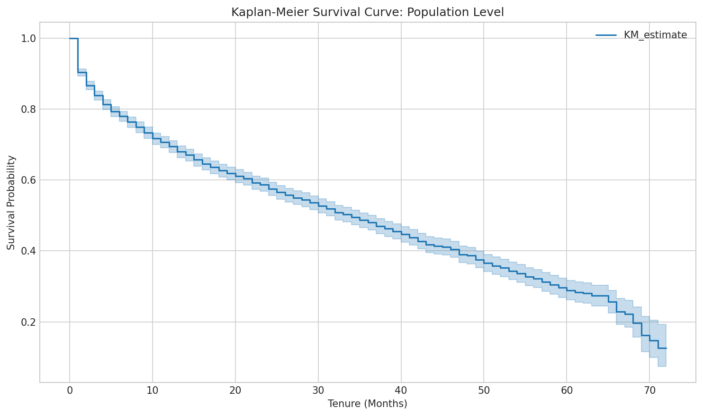
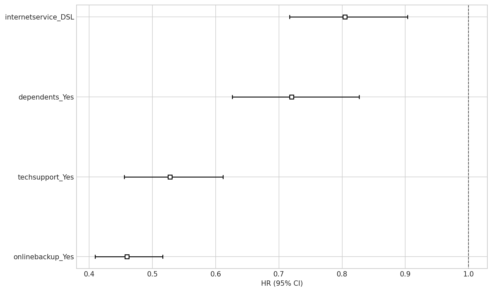
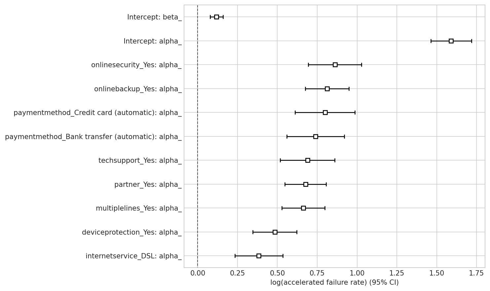
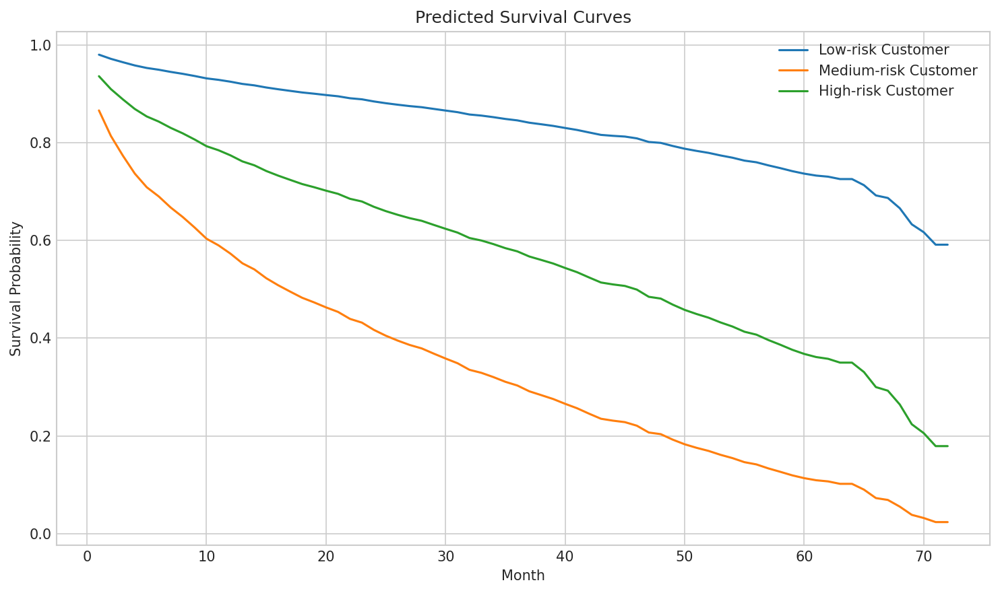

---

title: 'Survival Analysis Report: IBM Telco Customer Churn'
date: 2026-4-27
permalink: /posts/2026/04/survival-analysis-report/
tags:
  - sta323
  - survival analysis

---

# Survival Analysis Report: IBM Telco Customer Churn

## 1. Data Overview

**Dataset:** IBM Telco Customer Churn (7,043 customers, 21 features)

**Filtering Criteria:**
- Contract type: Month-to-month
- Internet service: Not "No" (DSL or Fiber optic)

**Final Sample:** 3,351 customers
- Churned: 1,556 (46.4%)
- Not churned (censored): 1,795 (53.6%)

The filtering focuses on customers most at risk of churning — month-to-month contract holders with active internet service — providing a more targeted analysis of churn behavior.

## 2. Kaplan-Meier Survival Analysis

### Population-Level Survival Curve

| Metric | Value |
|--------|-------|
| Observations | 3,351 |
| Events (churn) | 1,556 |
| Censored | 1,795 |
| **Median survival time** | **34.00 months** |

The median survival time of 34 months means that 50% of customers churn by month 34. The survival probability drops rapidly in the first few months, indicating high early-stage churn risk.

### DSL Customer Survival Probabilities (first 10 months)

| Month | Survival Probability |
|-------|---------------------|
| 0 | 1.000 |
| 1 | 0.903 |
| 2 | 0.864 |
| 3 | 0.835 |
| 4 | 0.811 |
| 5 | 0.794 |
| 6 | 0.784 |
| 7 | 0.776 |
| 8 | 0.768 |
| 9 | 0.751 |
| 10 | 0.741 |

DSL customers experience a ~10% churn in the first month, then the survival curve gradually flattens.

### Log-Rank Test Results

| Covariate | Test Statistic | p-value | Significant? |
|-----------|---------------|---------|--------------|
| gender | 2.04 | 0.153 | No |
| seniorcitizen | 0.13 | 0.723 | No |
| partner | 135.76 | 2.25e-31 | **Yes** |
| internetservice | 25.17 | 5.24e-07 | **Yes** |
| onlinesecurity | 141.60 | 1.19e-32 | **Yes** |
| techsupport | 90.43 | 1.92e-21 | **Yes** |
| paperlessbilling | 8.34 | 0.0039 | **Yes** |
| paymentmethod | varies | varies | **Yes** (varies by pair) |

**Key findings:**
- **No significant difference:** Gender and senior citizen status do not significantly affect survival/churn patterns.
- **Strongest effects:** Online security and partner status show the most significant differences (largest test statistics).
- **Payment method:** Pairwise comparisons show Electronic check has significantly higher churn than Bank transfer and Mailed check.

## 3. Cox Proportional Hazards Model

### Model Specification

| Feature | Baseline value |
|---------|---------------|
| dependents | No |
| internetservice | Fiber optic |
| onlinebackup | No |
| techsupport | No |

### Model Results

| Covariate | Coef | exp(coef) (HR) | p-value |
|-----------|------|----------------|---------|
| dependents_Yes | -0.33 | 0.72 | <0.005 |
| internetservice_DSL | -0.22 | 0.80 | <0.005 |
| onlinebackup_Yes | -0.78 | 0.46 | <0.005 |
| techsupport_Yes | -0.64 | 0.53 | <0.005 |

**Model metrics:**
- Concordance: 0.64
- Partial AIC: 22639.90
- Log-likelihood ratio test: 337.77 (p < 0.005)

### Hazard Ratio Interpretation

All four covariates are statistically significant (p < 0.005):

1. **Online backup** (HR = 0.46): Strongest protective factor. Customers with online backup have 54% lower churn risk than those without.

2. **Tech support** (HR = 0.53): Second strongest protective factor. Having tech support reduces churn risk by 47%.

3. **Dependents** (HR = 0.72): Customers with dependents have 28% lower churn risk.

4. **DSL internet** (HR = 0.80): DSL customers have 20% lower churn risk compared to Fiber optic customers.

### Proportional Hazards Assumption Violations

Three of four covariates failed the proportional hazards assumption:

| Covariate | Schoenfeld p-value | Violated? |
|-----------|-------------------|-----------|
| dependents_Yes | 0.22 | No |
| internetservice_DSL | <0.005 | **Yes** |
| onlinebackup_Yes | <0.005 | **Yes** |
| techsupport_Yes | <0.005 | **Yes** |

**Implications:** The effect of internetservice, onlinebackup, and techsupport on churn risk changes over time. This is expected in churn analysis — for example, the protective effect of techsupport may be strongest in early months when customers are learning the service.

**Recommended remedies:**
- Stratify the model on violating covariates
- Use time-dependent covariates
- Switch to AFT model (which does not require PH assumption)

## 4. Accelerated Failure Time (AFT) Model

### Log-Logistic AFT Results

| Covariate (alpha) | Coef | exp(coef) | p-value |
|-------------------|------|-----------|---------|
| onlinesecurity_Yes | 0.86 | 2.37 | <0.005 |
| partner_Yes | 0.68 | 1.97 | <0.005 |
| techsupport_Yes | 0.69 | 1.99 | <0.005 |
| onlinebackup_Yes | 0.81 | 2.25 | <0.005 |
| multiplelines_Yes | 0.66 | 1.94 | <0.005 |
| internetservice_DSL | 0.38 | 1.47 | <0.005 |
| deviceprotection_Yes | 0.48 | 1.62 | <0.005 |
| paymentmethod_Credit card (auto) | 0.80 | 2.22 | <0.005 |
| paymentmethod_Bank transfer (auto) | 0.74 | 2.10 | <0.005 |

**Model metrics:**
- Concordance: 0.73
- AIC: 13698.72

**Interpretation:** In the AFT model, exp(coef) > 1 means the covariate *accelerates* failure (shorter survival time). The AFT results are generally consistent with the Cox PH results but with the direction reversed in interpretation.

### Distribution Comparison (AIC)

| Distribution | AIC |
|--------------|-----|
| **Log-Normal** | **13625.86** |
| Log-Logistic | 13698.72 |
| Weibull | 13771.07 |

**Best fitting distribution: Log-Normal** (lowest AIC). This suggests the log of survival time approximately follows a normal distribution, which is common in churn data where most customers churn within a specific time window.

## 5. Conclusions and Recommendations

### Key Findings

1. **Early churn is the biggest risk:** Survival probability drops to ~90% by month 1 and ~74% by month 10 for DSL customers, indicating the first few months are the most critical retention period.

2. **Most impactful retention levers:**
   - **Online backup** (HR = 0.46) — strongest protective factor
   - **Tech support** (HR = 0.53) — second strongest
   - These suggest that bundling value-added services significantly reduces churn

3. **Demographics are not significant:** Gender and senior citizen status do not differentiate churn patterns (Log-Rank p > 0.05). Retention strategies should focus on service features rather than demographics.

4. **Internet service type matters:** Fiber optic customers have higher churn risk than DSL customers, likely because Fiber optic customers also pay more and may be more price-sensitive.

5. **Cox PH assumption violations exist:** The proportional hazards assumption is violated for 3 of 4 covariates, suggesting the AFT model may be more appropriate for this dataset.

### Recommendations

- **Bundle online backup and tech support** with new customer plans to reduce early churn
- **Focus retention efforts on the first 6 months** when churn risk is highest
- **Use the Log-Normal AFT model** for more accurate lifetime value predictions
- **Monitor fiber optic customers** more closely as they have higher churn propensity

## 6. Output Files

All figures and statistical test results are saved in `output/`:

| Type | Files |
|------|-------|
| KM Survival Curves | `km_population_curve.png`, `km_*.png` (9 covariates) |
| Log-Rank Test CSVs | `logrank_*.csv` (9 covariates) |
| Log-Log KM Plots | `loglog_*.png` (4 covariates) |
| Cox PH Plot | `cox_hazard_ratios.png` |
| AFT Plots | `aft_coefficients.png`, `aft_logodds_*.png` (7 covariates) |
| Survival Predictions | `predicted_survival_curves.png` |